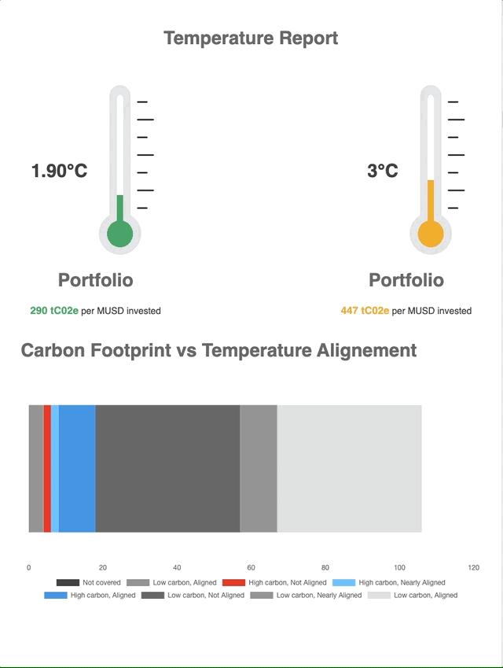

# LOIM DEMO

## Requirements

- NodeJS (v14.17.0+)
- NPM (6.14.13+)
- [Nx](https://nx.dev/)

## Get Started

Steps:

1. `git clone git@github.com:tyrcord/loim-experiments.git`

2. `cd loim-experiments && npm i`

3. run the front-end app: `npm start`

4. run the server api: `npm run start:api`

5. open [http://localhost:4200/](http://localhost:4200/)
